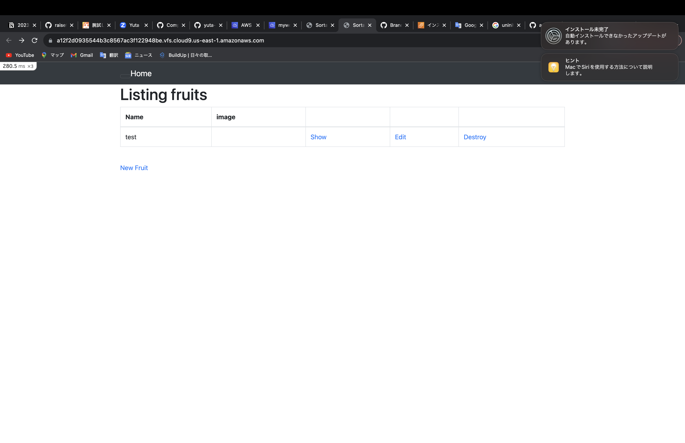
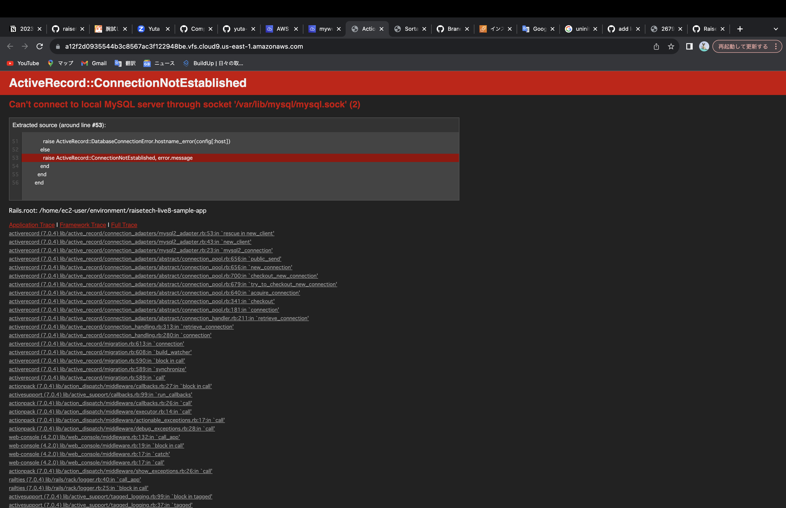

# 第３回課題
#### サンプルアプリケーションデプロイ

#### APサーバーの名前とバージョン
Rails7.0.4

#### APサーバーを終了させた場合、アクセス出来るか。
出来ない、下記のような画面になる。

#### DBサーバーの名前とバージョン
MySQL8.0.34

#### DBサーバーを終了させた場合、アクセス出来るか。
出来ない、下記のような画面になる。

#### Railsの構成管理ツールの名前
bundler
### 第3課題で学んだ事
cloud9は初期yurnが入っていないので、インストールする

アプリケーションはWEBサーバー、APサーバー、DBサーバーで３層構造になっている

プレゼンテーション層がWEBサーバー、アプリケーション層がAPサーバー、データ層がDBサーバー

